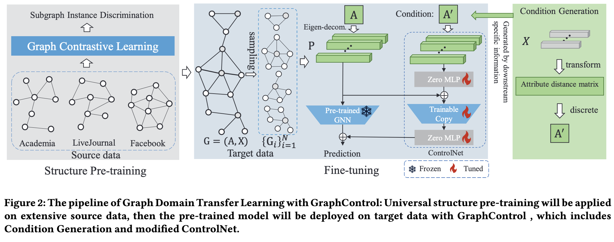

# GraphControl: Adding Conditional Control to Universal Graph Pre-trained Models for Graph Domain Transfer Learning

**Official implementation of paper**  <br>[GraphControl: Adding Conditional Control to Universal Graph Pre-trained Models for Graph Domain Transfer Learning](https://arxiv.org/abs/2310.07365) <br>

## Overview




## Setup

```bash
conda create -n GraphControl python==3.9
conda activate GraphControl 
conda install pytorch==2.1.0 torchaudio==2.1.0 cudatoolkit=12.1 -c pytorch -c conda-forge
pip install torch-scatter torch-sparse torch-cluster torch-spline-conv torch-geometric -f https://data.pyg.org/whl/torch-2.1.0+cu121.html
```

## Download GCC Pretrained Weight

**Download GCC checkpoints**
Download GCC checkpoint from https://drive.google.com/file/d/1lYW_idy9PwSdPEC7j9IH5I5Hc7Qv-22-/view and save it into ./checkpoint/gcc.pth and save it into ./checkpoint/gcc.pth

## For Attributed Graphs

**Only GCC**

```bash
CUDA_VISIBLE_DEVICES=0 python gcc.py --lr 1e-3 --epochs 100 --dataset Cora_ML --model GCC --use_adj --seeds 0 1 2 3 4 5 6 7 8 9 10 11 12 13 14 15 16 17 18 19
```

**GCC ControlNet**

```bash
CUDA_VISIBLE_DEVICES=0 python graphcontrol.py --dataset Cora_ML --epochs 100 --lr 0.5 --optimizer adamw --weight_decay 5e-4 --threshold 0.17 --walk_steps 256 --restart 0.8 --seeds 0 1 2 3 4 5 6 7 8 9 10 11 12 13 14 15 16 17 18 19
```

## For Non-attributed Graphs

**For non-attribute graphs, we need to generate nodes attributes through node2vec**

```bash
CUDA_VISIBLE_DEVICES=0 python node2vec.py --dataset Hindex --lr 1e-2 --epochs 100
```

**Then, we can train it as the same way with attributed graphs**

```bash
CUDA_VISIBLE_DEVICES=0 python graphcontrol.py --dataset Hindex --epochs 100 --lr 0.1 --optimizer sgd --weight_decay 5e-4 --threshold 0.17 --walk_steps 256 --restart 0.5 --seeds 0 1 2 3 4 5 6 7 8 9 10 11 12 13 14 15 16 17 18 19
```

